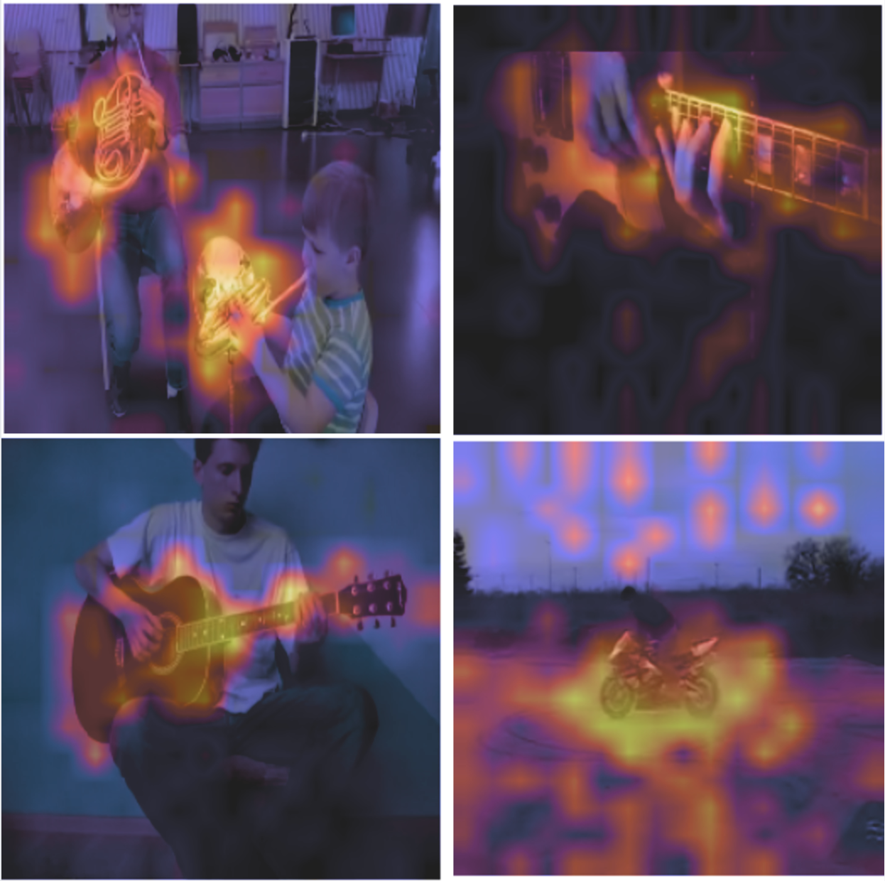

# Audio-Visual Feature Grounding

A PyTorch implementation for learning aligned audio-visual representations through contrastive learning. This repository provides a baseline implementation that learns to map corresponding audio and visual segments to similar points in a shared embedding space.

## Approach

The model learns alignments between audio and visual modalities using:
- HuBERT for audio feature extraction
- DINOv2 for visual feature embedding
- Cross-modal contrastive learning with max-mean pooling strategy

For each audio token, the model learns to maximize cosine similarity with its corresponding visual features for matching pairs while minimizing it for non-matching pairs. The max-mean strategy:
1. Computes cosine similarities between each audio token and all visual tokens
2. Takes the maximum similarity across visual tokens for each audio token
3. Averages these maximal similarities to get the final audio-visual alignment score

## Implementation Details

Key components:
- **Audio Processing**: Raw waveform → HuBERT embeddings
- **Visual Processing**: Frame → DINOv2 patch embeddings  
- **Training**: InfoNCE loss with temperature scaling and regularization
- **Visualization**: Cross-modal attention maps showing audio-visual alignments

## Results

Learned attention maps from an extremely early checkpoint:


## Usage

```markdown
Usage

Dataset Preparation
The model expects video data to be preprocessed into 1-second segments with a specific naming convention:
```python
{vid_num}_{segment_num}.mp4

# Example:
1_0.mp4    # First segment of video 1
1_1.mp4    # Second segment of video 1
2_0.mp4    # First segment of video 2
```

### Configuration
Create a config file `config.yaml`:
```yaml
training:
  video_dir: '/path/to/video/segments'        # Directory containing preprocessed 1s video segments
  output_dir: './outputs'                     # Directory to save checkpoints and visualizations
  batch_size: 48                              # Training batch size
  num_epochs: 100                             # Number of training epochs
  learning_rate: 8e-4                         # Peak learning rate for OneCycleLR
  num_workers: 12                             # Number of dataloader workers
  gradient_accumulation_steps: 1              # Number of steps to accumulate gradients
  save_every_steps: 4000                      # Save checkpoint every N steps
  device: 'cuda'                              # Training device ('cuda' or 'cpu')
  force_new_training: false                   # Force new training or resume from checkpoint

model:
  unfreeze_hubert_epoch: 2                    # Epoch to unfreeze HuBERT parameters
  unfreeze_vit_epoch: 5                       # Epoch to unfreeze ViT parameters

visualization:
  vis_every: 5000                             # Create visualizations every N steps
  num_vis_samples: 20                         # Number of samples to visualize

wandb:
  enabled: true                               # Enable Weights & Biases logging
  project: "Project_Name"                     # W&B project name
  run_name: "Run_Name"                        # W&B run name
```

### Training
```bash
python train.py --config config.yaml
```

The trainer will automatically:
- Resume from the latest checkpoint if available
- Create visualizations periodically showing audio-visual attention
- Log training metrics if W&B is enabled


## Notes
- This is a baseline implementation focused on reproducing core audio-visual learning concepts
- Currently trained on a subset of VGGSound dataset.
